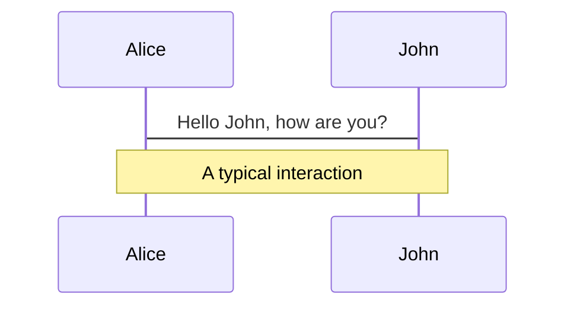
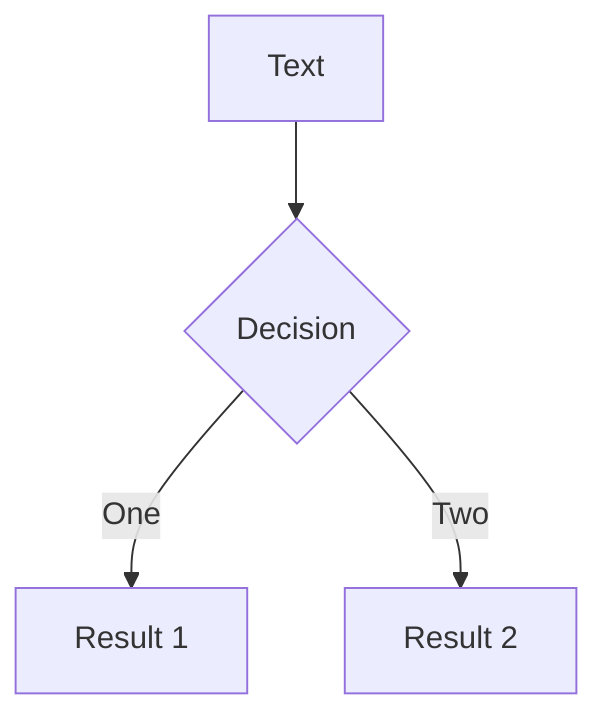
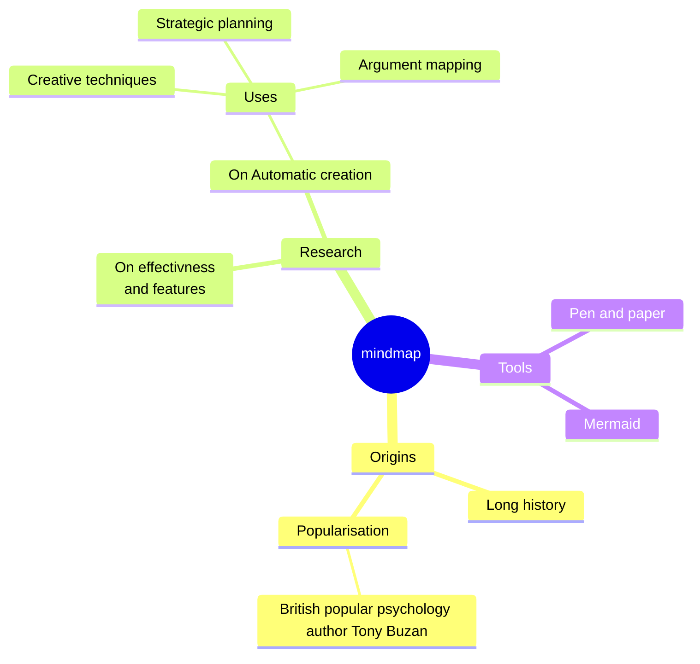
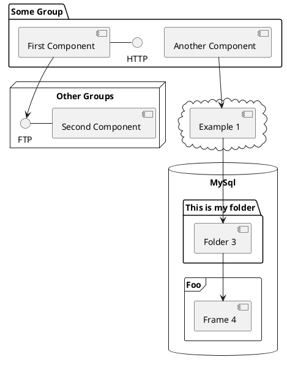

# Deriv-Com Road map

Rebranding Our codebase

  
    Press Space for next page <carbon:arrow-right class="inline"/>
  

  <a href="https://github.com/mohsen-deriv/deriv-com-roadmap" target="_blank" alt="GitHub"
    class="text-xl slidev-icon-btn opacity-50 !border-none !hover:text-white">
    <carbon-logo-github />
  </a>

<!--
The last comment block of each slide will be treated as slide notes. It will be visible and editable in Presenter Mode along with the slide. [Read more in the docs](https://sli.dev/guide/syntax.html#notes)
-->

---

# Front-end Team Achievements on Rebranding

Our rebranding efforts were not just about the UI, we re-branded our codebase as well to achieve:

- 📝 **Semantic HTML** - our developers can now provide better semantics for our pages
- 🎨 **Cleaner design and design system** - we studied the design system in order to setup a simple design system for deriv-com
- 🎨 **Atomic Design** - we introduced the atomic design to the project and home page is implemented with this approach
- 🧑‍💻 **Developer Experience** - our developer experience is much smoother now, faster deliveries is our goal
- 🤹 **Speed** - we improved the page, now the LCP is down to 2.5 sec from 5 sec
- 🎥 **Project Structure** - building a good foundation for the future (strapi, real-time features)

---

# Our Vision

Even though we want dynamic control over the content and features in deriv-com project, we need static HTML/CSS contents on the built version of it.

Here are the objectives we have in mind:

- Replace Gatsby with NextJS
- Separated Builds for EU and ROW version
- Use monorepo [nx](https://nx.dev/)
- Better Image delivery ( size, quality based on user's device )
- Faster Builds and Deployments
- Per page / component translations
- Light weight pages and faster page loads
- Separation of UI and Data ( content )
- Alignment with Strapi project ( Dynamic content )
- Test coverage on our components and logics ( not our pages )
- Smooth Developer Experience

---
theme: seriph
background: './images/question-mark-image.jpg'
class: text-center
highlighter: shiki
lineNumbers: false
layout: cover
---
# Why?

---

## Replace Gatsby with NextJS

Our project is moving away from developer dependant style, we want more dynamic feature such as content dashboard, strapi connection and more control on our build system and data fetching.

Unfortunately Gatsby's plugin system is not the answer to our requirements anymore, we're having a lot of struggles with it.
on the other hand the NextJS frameworks provides:

- more control over our project ( dev env, build steps, data fetching, etc )
- it provides faster builds ( almost 70x faster )
- better localization strategies
- complete control over our images and assets ( no graphQL involved )

Using NextJS for deriv-com will add certain level of complexity to it and it's major shift and refactoring. but in order to modernize our project it's a required step.

> Note: there are other framework options in the market, but considering the team's current skill set ( React ), NextJS was chosen as the candidate.

---

## Separated Builds for EU and ROW version

Right now we have conditional rendering in 80% of pages on run-time to present the correct content to our users.

current codebase checks the url ( deriv.com or eu.deriv.com ) to determine the `IS_EU` and `IS_ROW` conditions.

we can setup two projects in a monorepo ( or without it ) and control the build type with some `ENV` variables or other methods.
the final build outputs will be static content for each type ( EU and ROW ).

both projects will use the same components and codebase but the build result will be different.
deployment will be easier and smoother for both types. not all changes in deriv.com should be dependant to eu.deriv.com

this will remove the huge overhead we have on runtime. most of our unused javascript issues reported by web vitals are caused by this factor.

---

## Use Monorepo [nx](https://nx.dev)

Managing our codebase with separated builds for each region will hard to handle. in order to have better control on our components we can use the [nx](https://nx.dev) project, this will enable us to:

- Share the components and logic between `EU` and `ROW` builds
- Faster build time, since we'll integrate the nx caching system.
- Better project structure
- More automation in place for page generation, etc. ( nx generators )
- Separated UI library
- Better control on tree-shaking which will help us generate smaller bundles
- Separated Image optimization with build-time caching and hashing, in a sense we'll consider images as codes

---

## Better Image delivery

In current structure we're using `gatsby-image-plugin` to optimize the images, every time we start / build the project we have to optimize the images, which takes around 20 minutes on our machines.

since we don't change our images that much we don't have to optimize them on each build / run, we'll create our own local image optimization engine to handle the process in a separate package ( in a monorepo ).

with this implemented in our project we can cache them and use the same images for future runs / builds.
this will drastically decrease the build time and dev time resources.

for a similar implementation, please check out [this repo](https://github.com/Niels-IO/next-image-export-optimizer)

---

## Per page / component translations

Every day we add more content to the application's codebase, which will generate more `texts`, `strings` to be translated. all of these translated strings will be included ( parsed and stored in memory ) in the first render of the page which causes the heavy page size issue.

our plan is to separate the translations by feature, page, component. so for example our navigation bar feature is always the same thing in all of our pages. we will create a namespace or section in our translation files specifically for navigation bar.

and with the same approach we'll separate each page content into it's own section. this will make our pages lighter but we might have duplicated words or strings in our translation files which can be handled by code to remove these duplications.

finally when we build the project, each page will only contain the needed strings in it and not the whole translation files.

which will help to reduce the page size.

> Note: this will require good communication between FE team and translation team. we can setup good processes to handle the situation.

---

## Separation of UI and Data

In our current structure our content is directly included in our codebase, basically our components will check the do the conditional rendering on runtime and then based on the passed condition will render a portion of our content.

we need to separate our content from our code, in a sense our code will be injected by our content ( it can be from strapi, json, js object ) and then based on the condition it will render the correct portion of our content.

we have all the functionalities and logics in place to implements this, this task is still in progress.
currently homepage, navigation bar, footer is implemented with this approach.

---

## Alignment with Strapi project

We've taken a different path in past couple of month to provide better control over our content and provide means and mediums for the managers and content team to have control on changing the contents.

As of now the status of the strapi project is still in progress, most of the needed steps are done but unfortunately the deriv-com codebase is not ready to accept this kind of dynamic structure ( please have a look at separation or data and UI slide )

---

# Diagrams

You can create diagrams / graphs from textual descriptions, directly in your Markdown.

